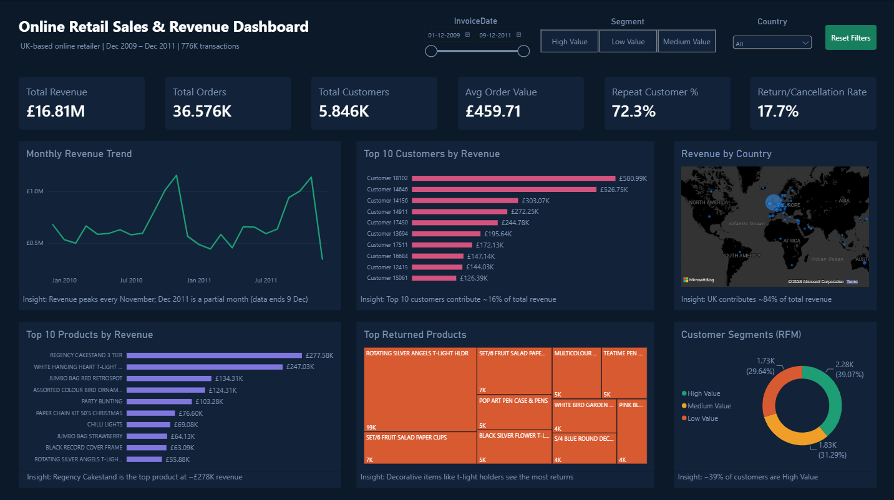

# Online Retail Sales & Revenue Dashboard

A single-page Power BI dashboard built on two years of real UK online retail transactions — covering revenue trends, top products, customer behavior, returns, and RFM-based customer segmentation.



## About this project

I wanted a project that mirrored what a Data Analyst actually does day to day — take messy raw transaction data, clean it, make sense of it, and turn it into something a business team could actually use. So I picked a real 1M+ row retail dataset, cleaned and transformed it in Python, and built a single-page dashboard in Power BI around the questions a sales team would realistically ask: where's our revenue coming from, who are our best customers, and where are we losing money to returns.

## Dataset

- **Source:** [UCI Machine Learning Repository — Online Retail II](https://archive.ics.uci.edu/dataset/502/online+retail+ii)
- A real transactional dataset from a UK-based online retailer selling gift items and homeware. A lot of the customers are wholesalers buying in bulk.
- **Time period:** Dec 2009 – Dec 2011
- **Size:** 1,067,371 rows, 8 columns to start

## Tools used

Python (Pandas, Matplotlib) for cleaning and exploration, Google Colab as the notebook environment, and Power BI (Power Query + DAX) for the dashboard.

## Cleaning the data

The raw data had a fair number of issues typical of real transactional data: duplicate rows, cancelled orders, missing customer IDs, non-product entries like postage and bank charges mixed into the product codes, and a couple of extreme bulk orders that would have skewed any average. I worked through each of these one at a time — for example, before dropping unusual product codes, I checked their descriptions individually to make sure I wasn't accidentally removing real products.

After cleaning, the dataset went from 1,067,371 rows down to 776,368 — about a 27% reduction, but still large enough to be statistically solid.

## What the analysis found

| Analysis | Finding |
|---|---|
| Monthly Revenue Trend | Peaks every November, ahead of the holiday season |
| Revenue by Country | UK contributes ~84% of total revenue |
| Top Products | "Regency Cakestand 3 Tier" leads at ~£277.58K |
| Top Customers | Top 10 customers bring in ~16% of total revenue |
| Customer Retention | 72.3% of customers are repeat buyers |
| Returns | 17.7% of invoices involve a cancellation; decorative items return the most |
| RFM Segmentation | ~39% High Value, ~31% Medium Value, ~29% Low Value |

## RFM segmentation

To go beyond basic totals, I segmented customers using RFM — Recency (how recently they ordered), Frequency (how often), and Monetary (how much they've spent). Each customer gets scored 1–4 on each dimension, and the combined score sorts them into High, Medium, or Low value groups. This kind of segmentation is genuinely useful for a business — it tells you who to focus retention efforts on.

## The dashboard

Everything lives on one page, since the goal was something a manager could glance at and immediately understand, not a report they'd have to click through.

**Top-level numbers:** Total Revenue, Total Orders, Total Customers, Average Order Value, Repeat Customer %, Return/Cancellation Rate

**Visuals:**
- Monthly revenue trend (line chart)
- Top 10 customers by revenue (bar chart)
- Revenue by country (map)
- Top 10 products by revenue (bar chart)
- Most returned products (treemap)
- Customer segments from the RFM analysis (donut chart)

It's also interactive — slicers for date range, customer segment, and country, plus a reset button to jump back to the default view.

## Files in this repo

| File | Description |
|---|---|
| `online_retail_dashboard.pbix` | Power BI dashboard |
| `data_cleaning_eda.ipynb` | Python notebook for cleaning and analysis |
| `dashboard_screenshot.png` | Dashboard preview image |
| `rfm_segments.csv` | Customer RFM scores and segments |
| `returns_data.csv` | Cancelled/returned order records |

> The full cleaned dataset (~776K rows) isn't included here due to GitHub's file size limits. It can be regenerated by running `data_cleaning_eda.ipynb` on the original [Online Retail II dataset](https://archive.ics.uci.edu/dataset/502/online+retail+ii).

## A few of the DAX measures

```DAX
Avg Order Value =
DIVIDE(
    SUM(online_retail_cleaned[Revenue]),
    DISTINCTCOUNT(online_retail_cleaned[Invoice])
)

Repeat Customer % =
DIVIDE(
    CALCULATE(
        DISTINCTCOUNT(online_retail_cleaned[Customer ID]),
        FILTER(
            VALUES(online_retail_cleaned[Customer ID]),
            CALCULATE(DISTINCTCOUNT(online_retail_cleaned[Invoice])) > 1
        )
    ),
    DISTINCTCOUNT(online_retail_cleaned[Customer ID])
)
```

## Author

Vaishnavi — Data Analyst / Power BI Developer
